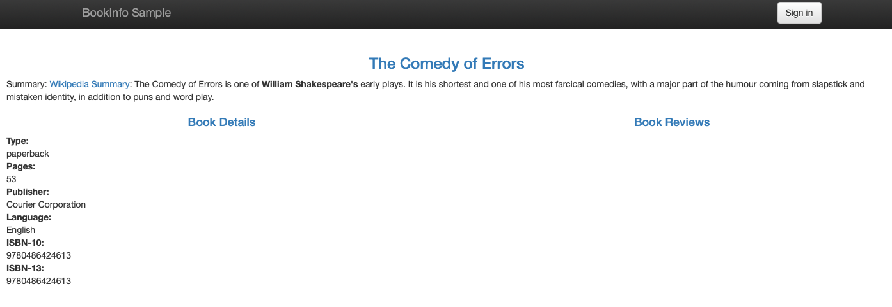

# Scalable Application Deployment

This project focuses on the **deployment of a reliable and scalable web application**, integrating key **DevOps** and **cloud computing** technologies. It aims to consolidate deployment knowledge from monolithic architectures to microservices using tools like **Docker** and **Kubernetes (K8s)**.

The project is structured into four main deployment phases:

1. **Monolithic Deployment on a Virtual Machine (VM)**
2. **Monolithic Deployment with Docker**
3. **Microservices Segmentation using Docker Compose**
4. **Microservices Deployment with Kubernetes**

## 💻 Application

The application is a **Bookinfo-like system** for managing book information.

Source code repository:

```bash
git clone https://github.com/CDPS-ETSIT/practica_creativa2.git
```

The goal is to evaluate different deployment technologies, identify challenges and solutions, and gain full-stack development experience with an industry-focused agile approach.

The goal is to evaluate different deployment technologies, identify challenges and solutions, and gain full-stack development experience with an **industry-focused agile approach**.

## 1. Monolithic Deployment on a Virtual Machine

Deploy the application as a **monolith** on a VM.

**Requirements:**

- Deploy on a **VM** (Google Cloud or similar).  
- Automate installation and configuration using a **Python script**.  
- Run `productpage_monolith.py` (located in `bookinfo/src/productpage`) on **port 9080**.  
- Manage dependencies with `requirements.txt` using `pip3`.  
- **Customization:** Display a group identifier in the page title using the `<GROUP_NUM>` environment variable.  
- **Access:** The application must be accessible externally via the VM’s public IP.



Internally, the application consists of two services: **Product Page** and **Product Details**.


## 2. Monolithic Deployment with Docker

Deploy the same application using **Docker** for lightweight virtualization.

**Requirements:**

- Define a single **`Dockerfile`** for the application.  
- Run the application on **port 5080**.  
- **Image Naming:** Use `product-page/<group_number>` with `python:3.7.7-slim` as the base image.  
- **Configuration:** Pass `<GROUP_NUM>` as an environment variable to customize the page title.  
- **Execution:** Run the container with the name `<service_name>-<group_number>`:  
```bash
docker run --name product-page-g45 -p 9080:9080 -e GROUP_NUM=45 -d product-page/g45
```
- Access: Web page must be externally accessible.

## 3. Microservices Segmentation with Docker Compose

Transition to a **microservices architecture**, separating the application into independent components. The application becomes **polyglot**, with each microservice developed in a different language:

- **Product Page** – Python  
- **Details** – Ruby  
- **Reviews** – Java (versions v1, v2, v3)  
- **Ratings** – NodeJS

**Requirements:**

- **Dockerfile per service**  
- Image naming: `<microservice_name>/<group_number>`  
- Include all three **Reviews** versions using the `SERVICE_VERSION` environment variable  
- Define a `docker-compose.yml` file to deploy all containers, maintaining necessary environment variables (e.g., `ENABLE_RATINGS=true`)  
- Container naming: `<service_name>-<group_number>`  
- Web must be fully functional; test each **Reviews** version individually.

**Dockerfile specifics:**

- **ProductPage:** Python base image  
- **Details:** `ruby:2.7.1-slim`, port 9080  
- **Reviews:** Build using `gradle clean build`, Dockerfile in `src/reviews/reviews-wlpcfg`  
- **Ratings:** `node:12.18.1-slim`, port 9080


## 4. Microservices Deployment with Kubernetes

Deploy Docker microservice images using **Kubernetes** (Minikube, Play-with-Kubernetes, or GKE).

**Requirements:**

- Create a Kubernetes cluster (recommend **GKE**) with **3 nodes** and no autoscaling  
- Define **Deployments** for each microservice (1 Pod, 1 Container per Deployment)  
- Replication factor:  
  - **Details:** 3 replicas  
  - **Ratings:** 2 replicas  
- Define **Services** for internal communication  
- **External Access:** Use a **LoadBalancer** or **NodePort** Service to access the application via **Product Page**

> Example YAML files are provided in `platform/kube` (`review-<version>-<type>.yaml`, `ratings.yml`)
